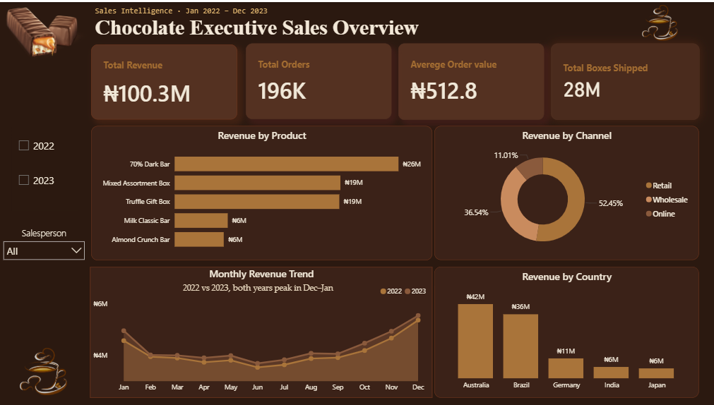
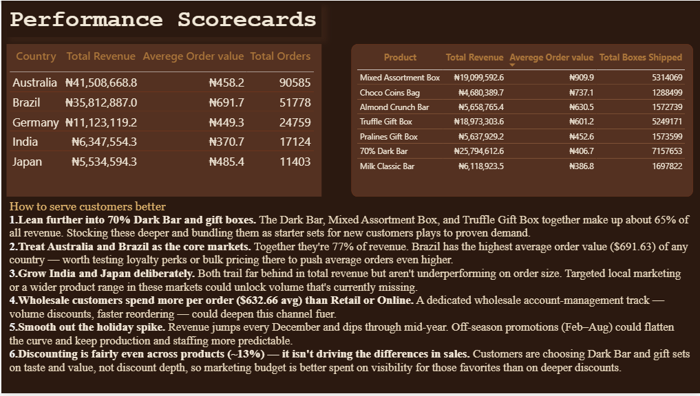

# 🍫 Chocolate Sales Analysis Dashboard

An interactive Excel dashboard built to analyze chocolate sales performance across products, countries, sales channels, and salespeople. This project was recreated as part of my Excel learning journey by following a dashboard tutorial and applying the concepts independently.

---

## 📌 Project Overview

This project analyzes two years of chocolate sales data (2022–2023) to uncover trends, monitor business performance, and provide actionable insights through an interactive Excel dashboard.

The dashboard enables users to explore sales performance across different products, countries, channels, and time periods using interactive filters.

---

## 🎯 Objectives

- Analyze overall sales performance.
- Identify top-performing products.
- Compare revenue across countries.
- Evaluate sales channels.
- Monitor monthly revenue trends.
- Generate business insights and recommendations.

---

## 🛠️ Tools & Skills Used

- Microsoft Excel
- Pivot Tables
- Pivot Charts
- Slicers
- Conditional Formatting
- Lookup Functions
- Dashboard Design
- Data Visualization

---

## 📂 Dataset

The dataset contains chocolate sales transactions from **January 2022 to December 2023**, including information on:

- Product
- Country
- Salesperson
- Sales Channel
- Revenue
- Boxes Shipped
- Orders
- Date

---

## 📊 Dashboard Features

### Executive Sales Overview

Tracks key business metrics:

- **Total Revenue:** ₦100.3M
- **Total Orders:** 196K
- **Average Order Value:** ₦512.8
- **Total Boxes Shipped:** 28M

Visualizations include:

- Revenue by Product
- Revenue by Country
- Revenue by Channel
- Monthly Revenue Trend
- Year Filter
- Salesperson Filter

---

### Performance Scorecards

Provides detailed performance analysis by:

- Country
- Product

Includes key metrics such as:

- Total Revenue
- Average Order Value
- Total Orders
- Total Boxes Shipped

---

## 📈 Key Insights

- **70% Dark Bar** generated the highest revenue.
- **Australia** and **Brazil** contributed the largest share of total revenue.
- **Retail** was the highest-performing sales channel.
- Revenue peaked in **December** across both years.
- Premium products and gift boxes generated a significant portion of total sales.

---

## 💡 Business Recommendations

- Increase inventory for high-performing products such as 70% Dark Bar and gift boxes.
- Prioritize Australia and Brazil for customer retention and marketing campaigns.
- Expand wholesale partnerships to increase average order value.
- Launch seasonal promotions before the December sales peak.
- Grow underperforming markets through targeted marketing initiatives.

---

## 📸 Dashboard Preview

### Executive Sales Overview

> **
### Performance Scorecards

> **

### ⭐ If you found this project interesting, consider giving it a star

                                                                                                                          ## 👩🏽‍💻 Author
                                                                                                                          **Salome Aondoakaa**
                                                                                                                          
                                                                                                                               Data Analyst
